# How to write a(n agent) plugin for RHQ and JBoss ON? #

By Heiko W. Rupp <heiko.rupp@redhat.com>

Preface:
This document builds on a series of blog postings I made on my blog at <http://pilhuhn.blogspot.com/search/label/RHQ> . This blog also features other JBoss ON, RHQ and plugin related content that is not contained here. While this document also applies to JBoss Operations Network (JBoss ON), I usually will just talk about RHQ.

Please contact me or my colleagues if you have questions or suggestions.

## Introduction ##

RHQ Project is the foundation of a powerful open source system management suite. It builds the framework for other management applications like JBoss ON.

Red Hat and Hyperic released Project RHQ in the open in February 2008 and we released the first GA version of RHQ together with JBossON 2.0 that is built on top of RHQ at JavaOne 2008.

This paper will try to show how to write your own plugins for RHQ. This could be „bare metal“ plugins to e.g. determine free disk space or process availability. It could also be a plugin that determines the number and volume of orders flowing through your web shop.

As an example scenario the plugin will try to reach a http server, see if the base URL is available and return the status code + the time it took to reach it. We will first write a simple version and enhance it afterwards. At the end I‘ll be talking about some additional topics around plugin development. But before we come to this, lets have a look at the environment.

## General architecture of RHQ ##

Before we go into detailed plugin writing, I first want to show the general architecture of RHQ and its plugin system.

RHQ follows a hub and spoke approach: A central server (or cluster of servers) processes data coming in from agents. The data is stored in a database connected to the server(s). Users / administrators can look at the data and trigger operations through a web-based GUI on the server

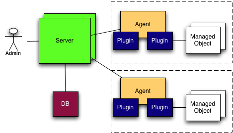

Agents do not have a fixed (read as in compile-time) functionality, but can be extended through plugins which we will see below. Usually there is one agent running per machine with resources to manage. The RHQ server itself is able to run an agent embedded in the server. This is mostly for demo and test scenarios, but it is well able to monitor the server machine.

## Server services ##

The server hosts a number of services like:

* It has a view on the complete Inventory
* It processes incoming measurement data
* It triggers alerts to be sent
* It triggers operations on managed resources
* It hosts the graphical user interface
* It hosts the user management
* ...

Some of those services are reflected in the agent like inventory syncing, gathering of measurement data or running operations on a managed resource, while alert processing or hosting of the GUI is purely on the server.
Note, that a RHQ server never directly talks to a managed resource. Only agents (or better: their plugins) talk to managed resources.

## Agent architecture ##

The agent is sort of a container that hosts some common functionality like the communication interface with the server, logging, starting and stopping of plugins, reading configuration files or spooling data in case the server is not reachable. It is also handling of the command line and interactive command prompt. 

In addition to this, it hosts the plugin container, who hosts the actual plugins. When you write a plugin, you talk to the plugin container.

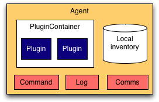

The agent also hosts its it is local view of the inventory (see next section) for the resources it knows.

## Central functionality: Inventory ##

The central piece of functionality in RHQ is the inventory. Each resource that you want to manage or monitor must be present in that inventory. RHQ has mechanisms to auto detect and also manually add resources. We‘ll come back to that later when we are talking about implementing plugins.
Each `org.rhq.core.domain.resource.Resource` has a certain `org.rhq.core.domain.resource.ResourceCategory`:

* Platform: This is basically a host where things run on
* Server: Things like database server, JbossAS instance or the RHQ agent
* Service: (Fine grained) Services offered by a server

The ResourceCategory is sort of hierarchic as you can see on the next image:

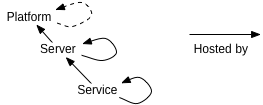

A platform hosts servers, a server can host other servers and services and a service can host other services. In theory it is also possible that a platform is hosting other platforms.
As an example: you have a Red Hat Linux platform, which hosts the RHQ Agent and JBossAS as a server. This AS it self is hosting a Tomcat server. Both JBossAS and Tomcat are hosting services like JMS or Connectors.
So at the end this will result in a tree of resources with the Linux platform as its root.
In addition to the category each Resource also is of a certain `org.rhq.core.domain.resource.ResourceType`. For a platform this might e.g. „Max OS X“, „Red Hat Linux“, „Debian Linux“ etc. Or the JBossAS and Tomcat from above are both of category Server, but have different ResourceType.

# The scenario revisited #

Our plugin should be able to connect to a http server, issue a GET or HEAD request on the base url (e.g. http://localhost/) and return the http return code as trait and the time it took as numeric data (see below).

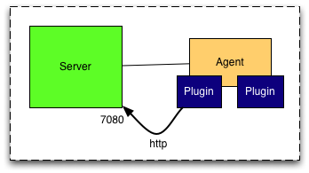

To make things easier for the purpose of this first implementation, we will have the agent running on the machine the RHQ server lives on and we will just try to get data from the Servers http connector at port 7080 (the default port).

## What do we need ? ##

In order to write our plugin we basically need three things:

* A plugin descriptor. This contains metadata about the plugin: which metrics should be collected, what operations does it support etc.
* A discovery component. This part discovers the actual resource(s) and delivers them to the Inventory.
* A plugin component. This component executes operations and gathers the measurement data etc.

So lets have a look into those three parts.

### Plugin descriptor ###

The plugin descriptor is described by an XML Schema that you can find in the subversion repository. The basic structure is as follows:

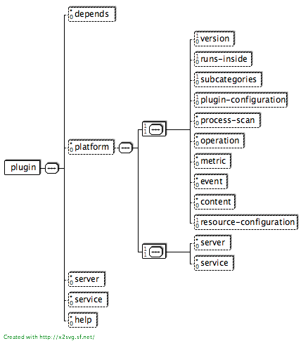

The descriptor consists of a few sections. First you can express dependencies to other plugins. This is allows reuse of existing plugins and is useful when you e.g. want to write a plugin that itself needs the JMX plugin, so that it can do its work (see also “Decomposing Plugins“ below).

The next are a row of platform/server/service sections. Each of those can have the same (XML-)content as the platform that is shown as an example – they are all of the same (XML-) data type (as a platform/server/service) as each is a kind of resource type, as you already know from the first part.
Example:

    <service name=“CheckHttp“>
        <metric property=“responseTime“
             description=“How long did it take to connect“
             displayType=“Summary“
             displayName=“Time to get the response“
             units=“ms“ />
    </service>

The name of a `<service>` and the other `ResourceType`s (platform, server) must be unique for a plugin. So it is not allowed to have two services named „CheckHttp“ within our example plugin, but you could write a Tomcat5 and a separate Tomcat6 plugin that both have a service with the name „connector“.

For the start we are especially interested in one of the sub elements: `metric` for our example plugin, so I will describe this here in a little more detail. For all other tags refer to the XML Schema that has a lot of comments.

#### The “Metric” element ####

This is a simple element with a bunch of attributes and no child tags. You have already seen an example above.
Attributes of it are:

* property: name of this metric. Can be obtained in the code via `getName()`
* description: A human readable description of the metric
* displayName: The name that gets displayed
* dataType: Type of metric (numeric / trait /...)
* units: The measurement units for numerical dataType
* displayType: if set to „summary“, the metric will show at the indicator charts and collected by default
* defaultOn: Shall this metric collected by default
* measurementType: what characteristics do the numerical values have (trends up, trends down, dynamic). The system will for trends* metrics, automatically create additional per minute metrics.

For the sample plugin we will use a metric with numerical `dataType` for the response time and a `dataType` of trait for the Status code. Traits are meant to be data values that only rarely change like OS version, IP Address of an ethernet interface or the hostname. RHQ is intelligent enough to only store changed traits to conserve space.

### Discovery component ###

The discovery component will be called by the `InventoryManager` in the agent to discover resources. This can be done by a process table scan (e.g. for the Postgres plugin) or by any other means (if your plugin wants to look for JMX-based resources, then it can just query the MbeanServer. Well, actually there is a JMX-Plugin that can do that for you in clever ways).

The most important thing here is that the Discovery component must **return the same unique key each time for the same resource**.

The DiscoveryComponent needs to implement `org.rhq.core.pluginapi.inventory.ResourceDiscoveryComponent` and you need to implement `discoverResources()`.
The usual code block that you will see in `discoverResources()` is:

    Set<DiscoveredResourceDetails> result = new HashSet<DiscoveredResourceDetails>();
      for ( ... ) {
         …
         DiscoveredResourceDetails detail = new DiscoveredResourceDetails( 
           context.getResourceType(),
           uniqueResourceKey,
           resourceName, 
           resourceVersion, 
           description,
           configuration, // can be null if no configuration 
           processInfo);  // can be null for no process scan 
         result.add(detail);
      }
      return result;

Basically the context passed in gives you a lot of information, that you can use to discover the resource and create a `DiscoveredResourceDetails` object per discovered resource. The list of result objects is then returned to the caller. Simple – eh?

### Plugin component ###

The plugin component is the part of the plugin that does the work after the discovery has finished.
For each of the „basic functions“ in the plugin descriptor, it needs to implement an appropriate Facet:

* `<metric>`: MeasurementFacet
* `<operation>`: OperationFacet
* `<resource-configuration>`:  ConfigurationFacet

Each Facet has its own methods to implement. In the case of the `MeasurementFacet` this is e.g. `getValues(MeasurementReport report, Set metrics)`. The report passed in is where you add your results. The `metrics` parameter is a list of metrics for which data should be gathered. This can be all of your defined `<metric>`s at once or only a few of them – this depends on the schedules the user configured in the GUI.
You will find more information about other factes below.
Remember: for the start we just have a very simple version of the plugin. We will enhance it below.
First let‘s talk about the project structure in the file system.

## The RHQ project structure ##

To make things easier, we will host this plugin just within the RHQ tree. So go and check out RHQ from [its git repo](http://git.fedorahosted.org/git/?p=rhq/rhq.git;a=summary). Build the project as described on the build page of the wiki2. After that is done, we will start to add our plugin into `modules/plugins/`. 
As an alternative, you can use the skeleton-plugin as described in the wiki – in this case you do not need to check out RHQ completely.

### Directory layout ###

Create the following directory structure:

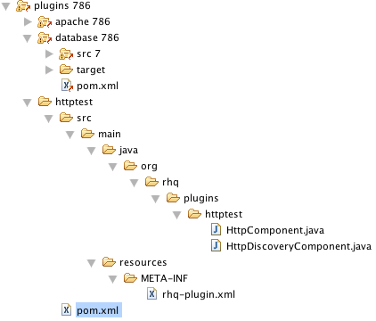

Add `modules/plugins/httptest/src/main/java` to the build path in your IDE.
The classes within `org.rhq.plugins.httptest` form the plugin discovery component and plugin component and will be described below.

### Maven pom ###

RHQ is a mavenized project, thus we need to supply a pom file. Easiest is to just grab another pom, copy it over to the root of the plugin subtree and change at least the `artifactId`:

    <groupId>org.rhq</groupId>
    <artifactId>rhq-httptest-plugin</artifactId>
    <packaging>jar</packaging>
    <name>RHQ HttpTest Plugin</name>
    <description>A plugin to monitor http servers</description>

Please note that this only defines the pom for this subtree – it will not add this to the global project. To do this, you need to add the httptest plugin to the parent pom at the `modules/plugins/` level:

    <modules>
       <module>platform</module>
         …
       <module>postgres</module>
       <module>httptest</module>
    </modules>

### The artifacts of our plugin ###

We will now look at the individual three artifacts that make up a plugin. The directory tree above shows where they are located.

#### Plugin discovery component ####

First we start with discovering our server. This is relatively simple and directly follows the description in the previous part.

    public class HttpDiscoveryComponent implements ResourceDiscoveryComponent
    {
      public Set discoverResources(ResourceDiscoveryContext context) throws 	
           InvalidPluginConfigurationException, Exception
      {
        Set<DiscoveredResourceDetails> result = new HashSet<DiscoveredResourceDetails>();
     
        String key = „http://localhost:7080/“; // Jon server
        String name = key;
        String description = „Http server at „ + key; 
        Configuration configuration = null; 
        ResourceType resourceType = context.getResourceType();  
        DiscoveredResourceDetails detail = new DiscoveredResourceDetails(
               resourceType, 
               key, 
               name, 
               null, 
               description, 
               configuration, 
               null );
        result.add(detail);
        return result;
      }
    }

Again it is extremely important that the key is/stays the same for each discovery performed!

#### Plugin component ####

So the next part is the plugin component to do the work:

    public class HttpComponent implements ResourceComponent, MeasurementFacet {
      URL url;       // remote server url
      long time;     // response time from last collection
      String status; // Status code from last collection

As we want to monitor stuff, we need to implement the `MeasurementFacet` with the `getValues()` method (see below).
But first we implement two of the methods from `ResourceComponent`. The first returns the availability of the remote server. We check if the status is `null` or 500 and return DOWN, otherwise UP.

      public AvailabilityType getAvailability() {
        if (status == null || status.startsWith(“5“))
          return AvailabilityType.DOWN; 
        return AvailabilityType.UP;
      }
    
One needs to be careful here, as the discovery will not happen as long as this method is returning DOWN. So we provide a valid start value in the `start()` method from the `ResourceComponent`:

      public void start(ResourceContext context) throws 	InvalidPluginConfigurationException, Exception
      {
        url = new URL(“http://localhost:7080/“); 
        // Provide an initial status, 
        //  so getAvailability() returns UP 
        status = „200“;
      }

Analogous to `start()` there is a `stop()` method, that can be used to clean up resources, which we leave empty and don‘t show it here.

This leads us to `getValues()` from the MeasurementFacet:

      public void getValues(MeasurementReport report, Set<MeasurementScheduleRequest> metrics) throws Exception
      {
        getData();
        // Loop over the incoming requests and 
        // fill in the requested data 
        for (MeasurementScheduleRequest request : metrics) {
          if (request.getName().equals(“responseTime“)) { 
            report.addData(new MeasurementDataNumeric( request, new Double(time))); 
          }
          else if (request.getName().equals(“status“)) {
            report.addData(new MeasurementDataTrait (request, status));
          }
        }
      }

We get data from the remote and then loop over the incoming request to see which metric is wanted and fill it in. Depending on the type we need to wrap it into the correct `MeasurementData*` class.
This leaves the implementation of `getData()`:

      private void getData()
      {
        HttpURLConnection con = null; int code = 0;
        try {
          con = (HttpURLConnection) url.openConnection();
          con.setConnectTimeout(1000);
          long now = System.currentTimeMillis(); 
          con.connect();
          code = con.getResponseCode(); 
          long t2 = System.currentTimeMillis(); 
          time = t2 – now;
        } catch (Exception e) {
          e.printStackTrace();
        }
        if (con != null)
          con.disconnect();
         status = String.valueOf(code);
      }

Again this is nothing fancy. Just open a URL connection, take the time it takes to connect, get the status code and we are done. Of course, this could be optimized, but for this article I wanted to use a simple solution.

#### Plugin descriptor ####

The plugin descriptor is where everything is glued together. First we start off with some „boiler plate“ code:

    <?xml version=“1.0“ encoding=“UTF-8“ ?>
    <plugin name=“HttpTest“
       displayName=“HttpTest plugin“
       package=“org.rhq.plugins.httptest“
       version=“2.0“
       description=“Monitoring of http servers“
       xmlns:xsi=“http://www.w3.org/2001/XMLSchema-instance“
       xmlns=“urn:xmlns:rhq-plugin“
       xmlns:c=“urn:xmlns:rhq-configuration“>

The package attribute predefines the Java package for Java class names that appear later in the descriptor.

      <server name=“HttpServer“
            discovery=“HttpDiscoveryComponent“
            class=“HttpComponent“
            description=“Http Server“>

We define our plugin as a Server. From the intuition it could be a Service, but Services can‘t just live on their own so we choose a server here. The attribute class denotes the plugin component and discovery the discovery component. If you have specified the package above, you can just use the class name without prefix.

      <metric property=“responseTime“
              displayName=“Response Time“ 
              measurementType=“dynamic“ 
              units=“milliseconds“
              displayType=“summary“/>
            
      <metric property=“status“
              displayName=“Status Code“
              dataType=“trait“
              displayType=“summary“/>
     </server>
    </plugin>

Now the two metrics. With all the knowledge you have now, they are nothing special anymore.
Again, `responseTime` is modeled as numerical data, while the status is modeled as trait. This could have been done differently, but is done here for educational purposes :-)

### Ready, steady, go ... ###

To compile the plugin, go to the root of the plugin tree and do mvn -Pdev install
The dev mode allows maven to automatically deploy the plugin to a server instance as described on the Advanced Built Notes page on the RHQ-Wiki.
When the server is running or starting up, you will see a line like this in the server log:

    14:23:31,558 INFO  [ProductPluginDeployer] Discovered agent plugin [HttpTest]
    14:23:31,574 INFO  [ProductPluginDeployer] Deploying [1] new or updated agent plugins: [HttpTest]
    14:23:31,665 INFO  [ResourceMetadataManagerBean] Updating resource type [HttpTest:HttpServer(id=0)]...
    14:23:31,667 INFO  [ResourceMetadataManagerBean] Persisting new ResourceType [HttpTest:HttpServer(id=0)]...
    14:23:31,791 INFO  [ProductPluginDeployer] Plugin metadata updates are complete for [1] plugins: [HttpTest]

The next step is to make the plugin available to the agent. Remember that the agent is usually pulling plugins from the server when it is starting up. So if you have not yet started the agent, there is nothing to do for you. If the agent is already started, you can issue `plugins update` at the command prompt to update them to the latest versions of the server.

    snert$ bin/rhq-agent.sh
    Listening for transport dt_socket at address: 8788
    RHQ 4.5.0-SNAPSHOT [963a082] (Tue Aug 21 09:57:02 EDT 2012)
    > plugins update
    The plugin container has been stopped.
    Updating plugins to their latest versions.
    The plugin [HttpTest] has been updated at [rhq-httptest-plugin-4.5.0-SNAPSHOT.jar].
    Completed updating the plugins to their latest versions.
    The plugin container has been started.
    > 

If you now log into the GUI at [http://localhost:7080/]() and go to Inventory->Discovery Queue you import the new server into Inventory.

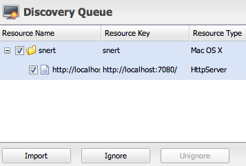

Next go to the resource browser, click on ‚Servers‘ and you can see the server ‚discovered‘ by our plugin:

Clicking on the server name (the link) leads you to the details page for the resource. Clicking on Monitoring->Graphs brings you to the graphical metric display, where (after some time) you can see the response time values:

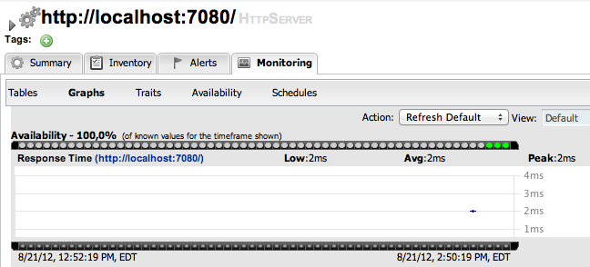

When you click on the Tables subtab, you can see the response time data for the server in a tabular way,
while the trait for the status code can be found on the Traits subtab.

## What do we have now? ##

Congratulations, you just wrote your first RHQ plugin, that can also be used in JBoss ON 2. Writing a plugin consists of three parts: Discovery, Plugin Component and plugin descriptor. The agent with its plugin container is providing you with all the infrastructure to talk to the server, scheduling of metric gathering, scheduling of discovery etc. This means that you can fully concentrate on the business code of your plugin. RHQ just does the rest.

I have made the source code of those articles available as zip archive, that you can unpack in the `modules/plugins/ directory`.

# Enhancing the plugin #

We have just built our first RHQ plugin. This was working great, but hardcoding the target URL is not really elegant. I will now show you how to make the target URLs configurable from the GUI.
To do this we need to reshuffle things a little: We will have a generic Server ‚HttpCheck‘ that servers as parent for the individual http-servers that we want to monitor. Those will live as Services under that Server. In the Server inventory we will add the possibility to manually add new http servers on the go.

Note: before you continue, go to Administration->Agent plugins and remove the old plugin.

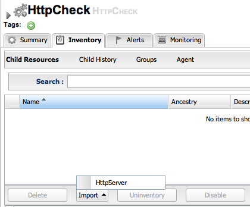

As you may have already guessed, most of this is done in the plugin descriptor. We also need some small code changes, but those are mostly to separate the concerns of the various files. Lets start with the changed plugin descriptor.

## Changed plugin descriptor ##

The boilerplate code is the same as before and will thus not be shown again.

    <server name=“HttpCheck“
        description=“Httpserver pinging“ 
        discovery=“HttpDiscoveryComponent“ 
        class=“HttpComponent“>

I have changed the name of the Server to HttpCheck, as this is nicer in the GUI. Now the interesting part starts:

      <service name=“HttpServer“
           discovery=“HttpServiceDiscoveryComponent“
           class=“HttpServiceComponent“
           description=“One remote Http Server“
           supportsManualAdd=“true“>
         
Here we introduce a Service as child of the above Server. It has its own Plugin Component and Discovery classes (the name of the classes reflect that they belong to this Service). Technically they could have gone into the existing classes, but this way it is more obvious who does what. The attribute _supportsManualAdd_ tells RHQ that those HttpServer Services can be added by the operator in the GUI – just what we want.

        <plugin-configuration>
           <c:simple-property name=“url“ type=“string“ required=“true“ />
        </plugin-configuration>

The plugin-configuration tells RHQ that this service can be configured with one simple property, the URL of the remote, which is required. I‘ll talk a bit more about properties in a minute.
Last but not least, we have moved the two metrics into the service tag (so I don‘t show them in detail again:

        <metric property=“responseTime“ …
        <metric property=“status“ …
       </service>
    </server>

### A word about configuration and properties ###

The configuration type presented here, can be used in two forms within a plugin descriptor: plugin-configuration and resource-configuration7. Check the structure diagram in section ‚plugin descriptor‘ above to see where they belong.
A configuration can consist of a number of sub-elements – notably properties that are children of the abstract configurationType. This is described below.

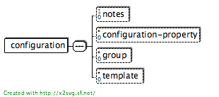

In addition it is possible to group properties together in the group element. The GUI will show those in their own collapsable section. Allowed child elements of group are one description element and instances of the abstract configuration-property. Templates allow you to preset some configuration properties, so the user has only to fill in stuff that is needed or that they want to change. The template itself is of the configuration type and thus no shown again.

#### Properties ####
Properties allow you to specify individual aspects of a configuration. There are three types of properties:

* simple-property: for one key value pair, as shown above
* map-property: for a bunch of key value pairs, following the java.util.Map concept
* list-property: for a list of properties.

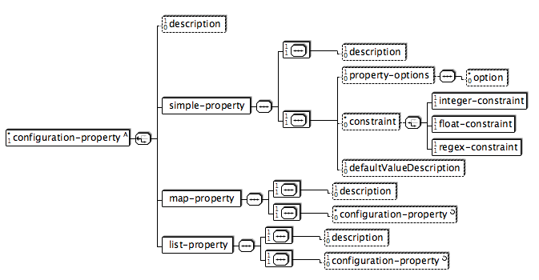

As you can see from the structural diagram, it is possible to nest configuration properties within list-property and map-property elements to compose more complex configurations.
If we would want to allow our Services to add multiple remote servers with properties of ‚host‘, ‚port‘, ‚protocol‘ it could look like this:

    <plugin-configuration>
      <c:list-property name=“Servers“>
        <c:map-property name=“OneServer“>
          <c:simple-property name=“host“/> 
          <c:simple-property name=“port“>
            <c:integer-constraint
                minimum=“0“
                maximum=“65535“/>
            </c:simple-property>
          <c:simple-property name=“protocol“>
            <c:property-options>
              <c:option value=“http“ default=“true“/>
              <c:option value=“https“/>
            </c:property-options>
          </c:simple-property>
        </c:map-property>
      </c:list-property>
    </plugin-configuration>
    
This example also shows a few more possibilities we have here: The port has a constraint so, the GUI can validate the input being between 0 and 2^16-1. For the protocol, we offer the user a drop down list / radio buttons to choose the protocol from. It defaults to ‚http‘, as indicated on the option element.

### Change in discovery components ###

These changes are – as already indicated – more or less just for clarity reasons and to clearly separate out the concerns of each component.

### Server level: HttpDiscoveryComponent ###

The HttpDiscoveryComponent from above only got some minor adjustments to cater for the change in naming, so I am not showing it here – have a look at the provided sources archive for details.

### Service level: HttpServiceDiscoveryComponent ###

The `HttpServiceDiscoveryComponent` is more interesting, as we no longer have the hard coded keys, but we get the URL passed in from the GUI when the user is adding a new one. Here you will also see a new facet (`ManualAddFacet`), that has been introduced to support `supportsManualAdd=“true“` from the plugin descriptor.
Let's start with the basic implementation of `ResourceDiscoveryComponent`:

    public class HttpServiceDiscoveryComponent implements
       ResourceDiscoveryComponent, ManualAddFacet
    {
       public Set<DiscoveredResourceDetails> discoverResources
            (ResourceDiscoveryContext context) throws
             InvalidPluginConfigurationException, Exception
       {
          return Collections.emptySet();
       }
       
This just returns an empty set, as we don't want to automatically discovery these kinds of resources.
The implementation of the `ManualAddFacet`then looks like this:
       
    @Override
    public DiscoveredResourceDetails discoverResource(Configuration pluginConfiguration,
        ResourceDiscoveryContext context) throws InvalidPluginConfigurationException {

        ResourceType resourceType = context.getResourceType();
        String key = pluginConfiguration.getSimpleValue("url", null);
        if (key == null)
            throw new InvalidPluginConfigurationException("No URL provided");
        String name = key;
        String description = "Http server at " + key;
        DiscoveredResourceDetails detail = new DiscoveredResourceDetails(
            resourceType, 
            key, 
            name, 
            null,
            description, 
            pluginConfiguration, 
            null);
        return detail;
    }
    
This methods gets one create request at a time passed in. We check if there is some url given
at all (in fact the definition in the plugin descriptor prevents empty properties already, but
it is good to check anyway) and then just creates a new `DiscoveredResourceDetails` object, which
is then returned.

### Change in plugin components ###

The change in plugin components in basically that the old `HttpComponent` got renamed to `HttpServiceComponent` and that we have a new „pseudo“ `HttpComponent` on server level.

### Server level - HttpComponent ###
Ok, this one is – as just described – a dummy implementation, as it just provides placeholder methods from the ResourceComponent interface.

    public AvailabilityType getAvailability() { 
        return AvailabilityType.UP;
      }

We set the Availability to being always UP so the component can successfully start. We leave the other two methods just as empty implementations.

### Service level - HttpServiceComponent ###
As indicated this is more or less the old HttpComponent except for one change:

    public void start(ResourceContext context) throws 
      InvalidPluginConfigurationException, Exception
      {
       url = new URL(context.getResourceKey()); // Provide an initial status, so
                                                // getAvailability() returns up 
       status = „200“;
      }

We are now setting the URL when the component is starting be reading it from the passed ResourceContext.
Building the enhanced plugin
The updated plugin can be built as shown in the previous part by calling mvn -Pdev install in the root of plugin source tree.

## Summary ##
You have just seen, how easy it is to pass plugin configuration parameters from the GUI to a plugin by expressing the parameters in the plugin descriptor. Our plugin is now able to have an arbitrary number of child services that each monitor a different remote http server. The changes needed are basically a few more lines of XML and a little bit more Java code.

The sources are again available as zip archive. Just install it like the previous one (overwrite the previous one).

# Things to consider when writing a plugin #

Now that you have seen how to write a plugin, lets have a short break to discuss a few things to consider when writing a plugin. 

The method `getValues()` from the MeasurementFacet is called from the plugin container in intervals given by the user. This is usually something in the minutes range, but could be shorter. As the container tries to call `getValues()` for all metrics of a resource (that are due for metric collection) at once, it means that taking a single metric can only take (interval / number of resources) time at maximum. So make gathering the metrics fast. If directly taking a metric takes a long time (e.g. because a connection to a resource needs to be established first), consider to start an own measurement thread that is taking the data and putting it into local storage and then have `getValues()` just read out the local storage.

Another thing to consider is the grouping of resource types:  when yo plan on having multiple items of one category (e.g. multiple http servers to check), then its good to have a parent for all of those, like the HttpComponent above. This is also good practice if you plan on implementing the addition of new child resources, as the create code needs to be in the parent (HttpComponent for HttpServices).

## Decomposing Plugins ##
When you try to manage larger systems like the JBoss Application Server with all its subsystems like Cache, Transactions, JBossWeb etc. your plugin might get relatively large to support all this. In this posting I will show you how to decompose a large(r) plugin into smaller ones that all together allow you to manage the large(r) system.

This decomposition not only allows you to more easily distribute the development load, but also enables re-use of the parts that have been broken out of the big chunk. The price you have to pay is relatively small and consists mostly of some additional directories and a maven pom.xml file (that I am not going to show here).

The basic trick is to use `<depends>` and `<runs-inside>` tags in your plugin descriptor for this new plugin:

      <plugin name="JBossCache" ... >
         <depends plugin="JMX" />
         <depends plugin="JBossAS" useClasses="true"/>

So we need the JMX plugin and the JBossAS plugin being deployed before our plugin can start. The attribute _useClasses_ means that the classloader of our plugin gets access to the classes of the other plugin (JBossAs here). So we can use those classes too.

      <service name="JBoss Cache" ...>

As you know from previous posts, a service can't just "hang in the air" - it needs another server or service as a container. This is where runs-inside comes into play:

       <runs-inside>
         <parent-resource-type name="JBossAS Server" plugin="JBossAS"/>
      </runs-inside>

So our plugin service "JBoss Cache" will be contained in resources of type "JBossAS Server" that come from the JBossAS plugin (that we declared in the depends element earlier).

Apart from this little magic in the plugin descriptor, there is no more additional work to do.

## Using Process scans for discovery ##

Often when you want to discover resources, they are not virtual like the remote http servers in our examples, but processes on the local machine. The RHQ agent offers through its SIGAR library to query the process table in order to detect those resources. As you may have guessed, this involves the plugin descriptor, so lets have a look at this first before going to the discovery component

### Process-scans in the plugin descriptor ###

As you have seen in the structural diagram of the plugin descriptor, each of platform/server/service can have `<process-scan>` elements. The element itself is empty, but has two required attributes: _name_ and _query_. Name just names this specific scan method. Query is the interesting part. It is a string written in PIQL (Process Info Query Language), which is documented in the JavaDoc to its class. I don‘t want to go into detail here and just show two queries. Visit the page just mentioned to learn more.

**Query 1: find a JBossAS**

    Process|basename|match=^java.*,arg|org.jboss.Main|match=.*

We want to query for a process, whose name is starting with java and which has an argument of org.jboss.Main – a Jboss Server. The matching entry from ps is:

    hrupp     2035   0.0 -1.5   724712  30616  p7  S+    9:49PM   0:01.61 java -Dprogram.name=run.sh 
     -Xms128m 
     -Xmx512m -Dsun.rmi.dgc.client.gcInterval=3600000 -Dsun.rmi.dgc.server.gcInterval=3600000 
     -Djboss.platform.mbeanserver -Djava.endorsed.dirs=/devel/jboss-4.0.5.GA/lib/endorsed -classpath 
     /devel/jboss-4.0.5.GA/bin/run.jar:/lib/tools.jar org.jboss.Main -c minimal
    
**Query 2: find a process by its pid**

Here the program id is stored in a file in a well known place
    process|pidfile|match=/etc/product/lock.pid

PIQL will take the pid from `/etc/product/lock.pid` and search for a process with that id

## Discovery component revisited ##

Ok, now that we have seen what we can do with the `<process-scan>` in the plugin descriptor, lets see how we can process that info. And .. as you may have already expected this is again very simple:

    List<ProcessScanResult> autoDiscoveryResults =
        context.getAutoDiscoveredProcesses(); 
    for (ProcessScanResult result : autoDiscoveryResults) { 
        ProcessInfo procInfo = result.getProcessInfo();
               ....
        // as before
        DiscoveredResourceDetails detail = 
            new DiscoveredResourceDetails( resourceType, key, name, null,
                 description, childConfig, procInfo );
        result.add(detail);
       }

So basically you jut need to obtain the list of resources discovered by process scan (auto discovered as opposed to a manual add) and create the `DiscoveredResourceDetails` as before. You can use ProcessInfo to get more information about the process and to even decide not to include it in the list of auto discovered resources (imagine, the PIQL query would have looked for processes where the name starts with post. This would apply to postgres and postmaster. Here you could still filter the ones you really want.

# A few more Facets #
We have seen the MeasurementFacet in the previous articles. In this section I will briefly mention the other kinds of facets, so that you can get an idea what plugins are capable to do.

## ConfigurationFacet ##

This facet indicates that the plugin is able to read and write the configuration of a managed resource. It goes hand in hand with `<resource-configuration>` in the plugin descriptor. As I've stated above, the code to create a new managed resource from scratch needs to be on the parent resource, so it is a good idea to write plugins that use the ConfigurationFacet in a way that they have a parent resource for the subsystem and children for individual resources. You can find an example for this in the JbossAS plugin when looking at the JbossMessaging subsystem and the individual JMS destinations.

## OperationFacet ##

An operation allows you to invoke functionality on the managed resource. This could be a restart operation or whatever you want to invoke on a target. Operations are described in `<operation>` elements in the plugin descriptor. They can have argument and return values.

## ContentFacet ##

This facet allows the uploading content like files or archives into the managed resource. That way it is possible to centrally manage software distribution into managed resources. There exists a `<content>` element as counterpart.

## Events ##

Events are a way to inject asynchronous data into the RHQ server. One example of Events within RHQ
is the gathering and parsing of logfiles. Events are a little bit like traits. The difference here is that one Event definition can match multiple event sources and that the number of Events that are delivered to the RHQ server can be different each time the polling for Events is called.
Events are processed by EventPollers – a method that gets called at a regular interval by the PluginContainer and which delivers one or more Events back into the system.
Two samples for EventPollers are the Logfile pollers, that check for new matching lines in logfiles and the snmptrapd plugin that I will describe now.
The plugin descriptor is mostly as we know it already. There is now one new element:

    <event name=“SnmpTrap“ description=“One single incoming trap“/>

The important part here is the name attribute, as we will need its content later again. The name is the key into the EventDefinition object.

### Plugin Component ###

In the plugin component, we are using start() and stop() to start and stop polling for events:

    public void start(ResourceContext context) throws InvalidPluginConfigurationException, Exception {
     
        eventContext = context.getEventContext(); 
        snmpTrapEventPoller = new SnmpTrapEventPoller(); 	
        eventContext.registerEventPoller(snmpTrapEventPoller, 60);

So first we are getting an EventContext from the passed ResourceContext, instantiate an EventPoller and register this Poller with the EventContext (60 is the number of seconds between polls).
The plugin container will start its timer when this registration is done.
In `stop()` we just unregister the poller again:

   eventContext.unregisterEventPoller(TRAP_TYPE);
   
TRAP_TYPE is the ResourceType name as String – we will see this again in a second.

The remainder of this class is nothing special and if you have read the plugin development series, it should actually be no news at all.

### Event Poller ###
This class is the only real new piece in the game.

    public class SnmpTrapEventPoller implements EventPoller {
    
Implementing EventPoller means to implement two methods:
    
      public String getEventType() {
        return SnmpTrapdComponent.TRAP_TYPE;
      }

Here we return the content of the name attribute from the `<event>` tag of the plugin descriptor. The plugin will not start if they don‘t match.

The other method to implement is `poll()`:

      public Set<Event> poll() {
        Set<Event> eventSet = new HashSet<Event>();
                  ...
        return eventSet;
      }

To create one Event object you just instantiate it. The needed type can just be obtained by a call to `getEventType()`.

# Tools: Plugin generator #

Above you have seen that writing a plugin is not that hard, but that it still needs a lot of work to
get the basic environment like plugin descriptor skeleton, maven-pom-file and directory structure in place.
RHQ project has a plugin generator, which asks you some questions and will then generate a plugin
with some dummy values, which you can then load into your development environment and continue
working with.

You can download the generator from RHQ's presence on [SourceForge](http://sourceforge.net/projects/rhq/files/rhq/plugin-generator/) or build it
from source in the RHQ source.

## Sample run

You can just start the plugin generator via `java -jar`. It will then
prompt you with a number of questions, where some have a default like 'n' in '(y/N)', that you can apply by pressing return.

    $ java -jar target/rhq-pluginGen-4.5.0-SNAPSHOT.jar 
    
First we need to determine the resource category of the root type in the plugin.

    Please specify the plugin root category PLATFORM(P), SERVER(S), SERVICE(I), s
Next we need to give the name of the base type of the plugin, which is also taken as the directory name of the plugin, the package for the plugin's classes as well as the base directory into which our plugin will be written.

    Please specify its Name: jmxdemo
    Please specify its PackagePrefix: org.rhq.plugins
    Please specify its FileSystemRoot: /im/rhq/modules/plugins
    
Finally you need to provide the class names of the component and discovery classes of the plugin. 
    
    Please specify its ComponentClass: DemoComponent
    Please specify its DiscoveryClass: DemoDiscovery
    
From here on, the generator asks for support of the various facets and
will then create respective entries in the plugin descriptor, as well
as in generated code artefacts.    
    
    Please specify if it should support Events (y/N): 
    Please specify its ParentType: MBeanResourceComponent
    Please specify if it should support HasMetrics (y/N): 
    Please specify if it should support HasOperations (y/N): 
    Please specify if it should support Singleton (y/N): 
    Please specify if it should support ResourceConfiguration (y/N): 
    Please specify if it should support SupportFacet (y/N): 
    Please specify if it should support CreateChildren (y/N): 
    Please specify if it should support UsesExternalJarsInPlugin (y/N): 
    Please specify if it should support DeleteChildren (y/N): 
    Please specify if it should support ManualAddOfResourceType (y/N): 
    Please specify if it should support UsePluginLifecycleListenerApi (y/N): 
    
If your plugin needs JMX to talk to the managed resource, you can use the JMX-plugin for RHQ that helps you with connecting to the JMX server etc.    
    
    Please specify if it should support DependsOnJmxPlugin (y/N): y

Finally you need to provide some more information about the plugin
itself like the version of RHQ to build with, the name as it shows up in the UI and some descriptions.
    
    Please specify its RhqVersion: 4.5.0-SNAPSHOT
    Please specify its PluginName: rhq-jmxdemo
    Please specify its PluginDescription: Test for local JMX connections
    Please specify its Description: Test JDK6 jmx connections
    
    Do you want to add a child to jmxdemo? (y/N) n
    
If you choose to add a child resource type to the above, you need to proide
the Facet and other information about the child type. Otherwise the generator
will continue, print a summary of your input and then generate the
artefacts.
    
    Aug 23, 2012 2:32:11 PM org.rhq.helpers.pluginGen.PluginGen run
    INFO: 
    You have chosen:
    Props{category=SERVER, name='jmxdemo', description='Test JDK6 jmx connections', packagePrefix='org.rhq.plugins', pkg='null', discoveryClass='DemoDiscovery', componentClass='DemoComponent', parentType='MBeanResourceComponent', fileSystemRoot='/im/rhq/modules/plugins', monitoring=false, operations=false, metricProps=[], operationProps=[], singleton=false, resourceConfiguration=false, events=false, supportFacet=false, createChildren=false, deleteChildren=false, usesExternalJarsInPlugin=false, manualAddOfResourceType=false, usePluginLifecycleListenerApi=false, dependsOnJmxPlugin=true, rhqVersion='4.5.0-SNAPSHOT', children=[], simpleProps=[], templates=[], runsInsides=[]}
    Aug 23, 2012 2:32:11 PM org.rhq.helpers.pluginGen.PluginGen generate
    INFO: Generating...
    Aug 23, 2012 2:32:11 PM org.rhq.helpers.pluginGen.PluginGen createFile
    INFO: Trying to generate /im/rhq/modules/plugins/jmxdemo/pom.xml
    Aug 23, 2012 2:32:11 PM org.rhq.helpers.pluginGen.PluginGen createFile
    INFO: Trying to generate /im/rhq/modules/plugins/jmxdemo/src/main/resources/META-INF/rhq-plugin.xml
    Aug 23, 2012 2:32:12 PM org.rhq.helpers.pluginGen.PluginGen createFile
    INFO: Trying to generate /im/rhq/modules/plugins/jmxdemo/src/main/java/org/rhq/plugins/jmxdemo/DemoDiscovery.java
    Aug 23, 2012 2:32:12 PM org.rhq.helpers.pluginGen.PluginGen createFile
    INFO: Trying to generate /im/rhq/modules/plugins/jmxdemo/src/main/java/org/rhq/plugins/jmxdemo/DemoComponent.java
    Aug 23, 2012 2:32:12 PM org.rhq.helpers.pluginGen.PluginGen generate
    INFO: Done ..
    
When it is done, it will also remind you of some next steps.
    
    Don't forget to 
      - add your plugin to the parent pom.xml if needed
      - edit pom.xml of your plugin
      - edit rhq-plugin.xml of your plugin

At this point you will have a plugin fragment that you can then load into your editor and start coding.

# Tools : Standalone plugin container #

Above I have described how you can deploy the plugin to the server and then when it is deployed tell the
agent to fetch it to also have it deployed there. Especially when you start writing a new plugin, this
process is tedious and slow.

Luckily there is a way you can test the functionality of the plugin classes without the need to deploy it to the server (If you need to see how things render on the server, you still need to deploy it there though). The 
_standalone plugin container_ allows you to just load the plugin you want to test (plus its dependencies)
and then issue commands in an interactive shell.

## Sample run ##

To start the standalone PC, you change into the agent directory, copy your plugin into the `plugins` subdirectory and then call

    $ bin/standalone-pc.sh

in the agent directory[^1], which will print a few messages about loading plugins and then wait at a command prompt. If your plugin does not show up in the printed list, it has probably some errors in the plugin descriptor. You
can find out by looking at the agent log in `logs/agent.log`.

    hrupp$ bin/standalone-pc.sh 
    
    Starting the plugin container.
    Loading plugins
    ...Loaded plugin: HttpCheck
    ...Loaded plugin: Platforms
    
    Ready.
    [0]:0 >

The command prompt now waits for your input. The number in the square brackets is the number of the current command. The number after the colon a resource id; we will see that in more detail later. To see a list of commands, you can type `help`, which shows a list of commands, their abbreviation, possible arguments and a short description.

One of the first things you want to do here is to discover resources

    [0]:0 > disc all
    Discovery took: 5408ms
    [Resource[id=-25, uuid=b1f......

To select a resource and to issues specific commands to it, you can set it's id:

    [1]:0 > set id -2
    [2]:-2 res
    Resource[id=-2, uuid=2eb2ef5b-9ad4-444b-a1a4-4cced69ff34f, type={Platforms}Mac OS X, key=snert, name=snert, parent=<null>, version=MacOSX 10.7.4]
    [3]:-2 > m -list
    Native.MemoryInfo.used : MEASUREMENT, The total used system memory (does not include buffer or cache memory)
    Native.MemoryInfo.actualUsed : MEASUREMENT, The actual total used system memory (includes buffer and cache memory)
    CpuPerc.sys : MEASUREMENT, Percentage of all CPUs running in system mode
    CpuPerc.user : MEASUREMENT, Percentage of all CPUs running in user mode
    [4]:-2 > m m CpuPerc.user
    MeasurementDataNumeric[name=CpuPerc.user, value=0.1188118811881188, scheduleId=1, timestamp=1342878190137]

In step 1, we selected resource id -2, then issued the `res` command to see specifics of the resource. In step 3,
we inquired the list of metrics and in step 4 queried the value of the metric with the name `CpuPer.user`. The first 'm' in the command is the command name monitor, the second means that this is a metric.

### Getting and setting the plugin configuration ###

Above we have seen how to set the URL for the target to monitor. You can also inspect and set those
values from the standalone container by running the __pc__ and __pcs__ commands:

    [5]:-2 > pc
    PropertyList[id=0, name=logs, list=[]]
    [6]:-2 > pcs logs=bla
    [7]:-2 > pc
    PropertySimple[id=0, name=logs, value=bla, override=null]
    

## Command history ##

When using the standalone-pc, you often want to repeat a command given. For this purpose a csh-like
command syntax exists. Issuing `!h` gives you an overview of existing commands.

To dispay the history you give `!?`:

    [8]:-2 > !?
    [0]: res
    [1]: set id -2
    [2]: m -list
    [3]: m m CpuPerc.user

To re-run command 2 you say `!2`; to just re-run the last command, you can simply type `!!`.

### Recording and replaying of commands ###

As you have just seen, the system keeps a list of commands issued. You can write that list of commands 
to a file via `!w <filename>`. When you then start the container with that filename as argument, it will
re-run the commands from the file.

    bin/standalone-pc.sh <filename>
    
When the standalone container has run all the commands, it will just shut down. In many times when developing
a new plugin, you want to continue issuing commands and for example check the executed plugin code in the
debugger. To achieve this, add a `stdin` command before writing the file (or edit the generated file afterwards).

# Tools: Plugin verification #

During development process you will often change items in the plugin descriptor and your java classes and
if you make a mistake, you will only find out when you deploy the plugin to the server (or the standalone
container). Actually there is a way to run a basic verification of the plugin. This checks some basic properties like the syntactical 
correctness of the plugin descriptor and if the classes that are denoted as discovery and component
classes can be found and loaded by the plugin classloaders.

## Standalone usage

To run the verification you can change into the agent directory and run `bin/plugin-validator.sh`[^2] 
with the plugin-jar as argument like this:

    $bin/plugin-validator.sh $DEV/modules/plugins/httpcheck/target/httpcheck-plugin.jar
    !OK!

If you made an error, the result will be `!FAILED`. In addition error and warning messages are printed on the
console. More comprehensive logging will written to the agent log
file at `log/agent.log`.

If you have written a plugin that depends on other plugins, you need to provide them all on the command line.

## As Part of the build ##

If you have checked out the whole RHQ source tree, you can add your plugin to the list of plugins to be verified
when a build of the plugins happens. This verification step checks some basic properties like the syntactical 
correctness of the plugin descriptor and if the classes that are denoted as discovery and component
classes can be found and loaded by the plugin classloaders.

To do this, you need to add your plugin to the list in `modules/plugins/validate-all-plugins/pom.xml`:

    <plugin>
      <artifactId>maven-antrun-plugin</artifactId>
      <executions>
        <execution>
          <phase>integration-test</phase>
          <configuration>
            <target>
              <property name="test.classpath" refid="maven.test.classpath" />
              <echo>Validating plugins...</echo>
              <java classname="org.rhq.core.pc.plugin.PluginValidator" failonerror="true" fork="true">
                <classpath>
                  <pathelement path="${test.classpath}" />
                  <pathelement location="../apache/target/rhq-apache-plugin-${project.version}.jar" />
                  <!-- as in the next line  vvvvv  -->
                  <pathelement location="../httpcheck/target/httpcheck-plugin-${project.version}.jar" />
                  <!-- ^^^^^^ -->

You just add the path to your plugin to the list of `<pathelement>` elements as shown above.

# More information on Plugins #

The RHQ wiki now hosts a plugin community page that shows available plugins: RHQ Plugin Community at <https://docs.jboss.org/author/display/RHQ/Plugin+Community>.

Check it out for any updates about plugin related information – including lists of new plugins.

RHQ developers can be reached in #rhq on irc.freenode.net, development forums are hosted on <https://community.jboss.org/en/rhq/>

# About the author  #
Heiko W. Rupp is developer at Red Hat in the area of RHQ and JBoss ON. He contributed to Jboss AS and other open source projects in the past and wrote the first German JBoss book and one of the first German books on EJB3. He lives with his family in Stuttgart, Germany.

[^1]: Before RHQ 4.5, this command was not installed by default in the agent's bin directory, but only in the sources under `etc/standalone-pc/` directory or on sourceforge at <http://sourceforge.net/projects/rhq/files/rhq/standalone-container/>.

[^2]: This standalone way is available from RHQ 4.5 on. Before 4.5 only the batch check when building all the plugins is available.
